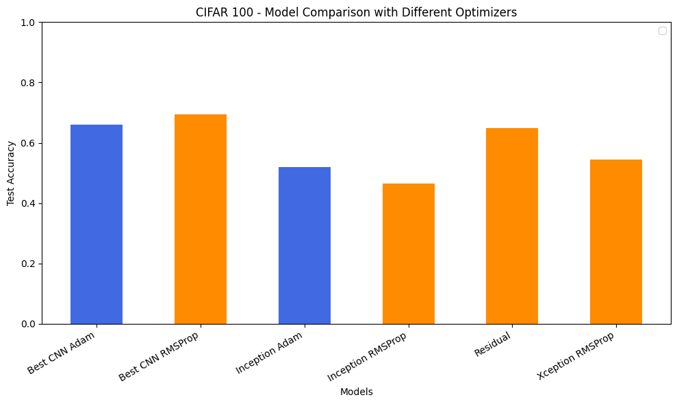

# CNN Superclass Classification on CIFAR-100

This project addresses an image classification problem using Convolutional Neural Networks (CNNs) on the CIFAR-100 dataset. Instead of predicting the original 100 fine-grained classes, the task focuses on classifying images into the 20 CIFAR-100 superclasses, reducing complexity while preserving semantic structure.

## Problem Overview

Image classification is a core task in computer vision. CIFAR-100 consists of 60,000 RGB images of size 32×32 pixels, split into 100 fine classes grouped into 20 superclasses.  

The objective of this project is to design, train, and evaluate a CNN capable of accurately predicting the superclass of an input image.

This setup allows the model to learn higher-level visual concepts while avoiding excessive class fragmentation.

## Dataset

- Dataset: CIFAR-100

- Image size: 32×32 RGB

- Training samples: 50,000

- Test samples: 10,000

- Target labels: 20 superclasses

## Methodology

- Data preprocessing and normalization

- Mapping fine-grained labels to superclass labels

- Design of a custom CNN architecture

- Model training with validation monitoring

- Evaluation using accuracy and loss metrics

- Analysis of learning behavior and generalization

## Model Architecture

The CNN architecture is composed of:

- Convolutional layers for feature extraction

- Pooling layers for spatial reduction

- Fully connected layers for classification

- Softmax output layer for multi-class prediction

The architecture was designed to balance performance and computational efficiency.

## Results

Several CNN-based architectures were evaluated on the CIFAR-100 superclass classification task. The results below report test accuracy for each model.

- Best CNN architecture: **66.13%**

- Residual CNN: **64.85%**

- Xception-based model: **54.44%**

- Inception-based model: **51.95%**

Given 20 target classes, a random classifier would achieve approximately \*\*5% accuracy\*\*, highlighting the effectiveness of convolutional architectures in learning meaningful high-level visual representations.

The comparison below illustrates the performance differences across architectures and optimizers.

These results indicate that simpler CNN and residual-based architectures outperform more complex designs such as Inception and Xception in this setting. While optimizer choice influences performance, architectural design and inductive bias appear to have a stronger impact on final accuracy.

## Technologies Used

- Python

- TensorFlow / Keras

- NumPy

- Pandas

- Matplotlib

## Project Structure

cnn-superclass-classification-cifar100/

├── notebooks/

│ └── cnn_superclass_classification_cifar100.ipynb

├── README.md

├── requirements.txt

└── .gitignore

## Author

Aitana Martínez

